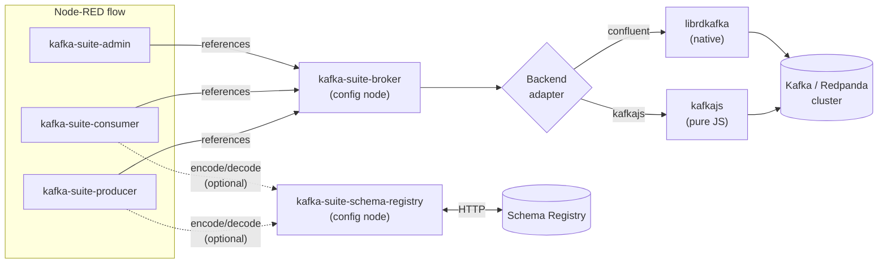
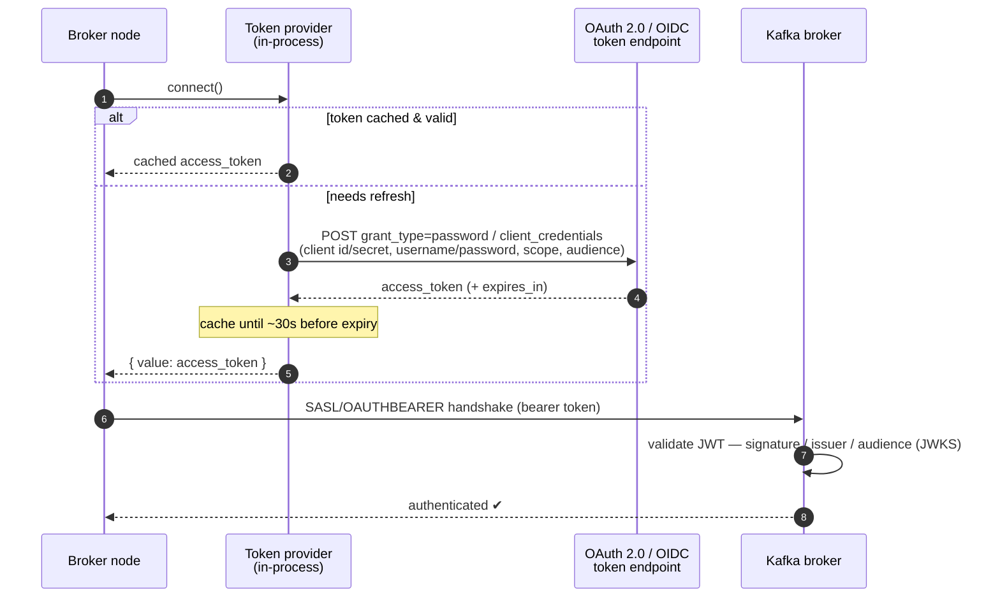

# node-red-contrib-kafka-suite

[](https://www.npmjs.com/package/node-red-contrib-kafka-suite)
[](https://www.npmjs.com/package/node-red-contrib-kafka-suite)
[](LICENSE)
[](https://nodered.org)

> **Status: 0.0.3 — Beta.** Functionally complete and end-to-end tested against
> five local Kafka setups (Confluent CP, Redpanda PLAINTEXT, Redpanda SASL_SSL,
> mTLS Aiven-style, and Keycloak + Redpanda OAUTHBEARER/OIDC) on both client
> backends (`kafkajs`, `@confluentinc/kafka-javascript`). It has **not yet** been
> validated against live managed services with paid accounts (Confluent Cloud,
> AWS MSK, Azure Event Hubs, Aiven). Please **try it and file issues** at
> <https://github.com/blanpa/node-red-contrib-kafka-suite/issues> — bug reports,
> reproductions, and editor-UX feedback are very welcome.

A comprehensive Apache Kafka integration for Node-RED with full producer,
consumer, admin, and Schema Registry support. Built around a dual-backend
abstraction layer (`kafkajs` + `@confluentinc/kafka-javascript`), with
service presets for the major managed Kafka offerings and OAuth 2.0 / OIDC
(OAUTHBEARER) authentication.

---

## Features

- **Producer** — single + batch mode, message keys, headers, explicit
  partition selection, compression (GZIP, Snappy, LZ4, ZSTD), delivery
  confirmation as `msg.kafka` on the success output.
- **Consumer** — consumer groups, auto/manual commit, pause/resume via control
  input, JSON / UTF-8 / Buffer payload formats, configurable concurrency.
- **Admin** — `listTopics`, `createTopic`, `deleteTopic`, `describeCluster`,
  `listGroups`, `describeGroup`, `fetchTopicOffsets`, `resetOffsets`,
  `deleteGroup`.
- **Schema Registry** — Confluent wire format (magic byte + schema id) for
  Avro, JSON Schema and Protobuf. Optional auto-registration of schemas from
  the producer when `msg.schemaDefinition` is provided.
- **Dual backend** — pick `kafkajs` (pure JS, runs everywhere) or `confluent`
  (native librdkafka, higher throughput, Kafka 4.0 ready) per broker config
  node.
- **Service presets** — Confluent Cloud, AWS MSK (IAM + SCRAM), Azure Event
  Hubs, Aiven, Redpanda, and self-hosted.
- **Authentication** — SASL/PLAIN, SCRAM-SHA-256/512, **OAUTHBEARER** (OAuth 2.0
  / OIDC with the `password` and `client_credentials` grants, Strimzi-style),
  mutual TLS (mTLS), or unauthenticated.
- **Connection management** — MQTT-style shared connection per broker config
  node, ref-counted producer/consumer/admin lifecycle, auto-reconnect with
  exponential backoff, status badges propagated to the editor.
- **Error handling** via Node-RED's standard error channel — attach a
  `catch` node scoped to the producer/admin/consumer to handle failures
  (invalid topic, schema-registry errors, unknown admin action, etc.).

---

## Architecture

The producer, consumer, and admin nodes never talk to Kafka directly. They all
share **one connection** through the `kafka-suite-broker` config node, which
delegates to one of two interchangeable backend adapters. Your flow logic is
identical regardless of the backend or the Kafka distribution behind it.



- **One broker connection, ref-counted.** The broker node opens the connection
  when the first child node needs it and closes it when the last one is removed
  (MQTT-style), with auto-reconnect and exponential backoff.
- **Adapter abstraction.** Every backend implements the same interface
  (`lib/adapter-interface.js`), so producer/consumer/admin code is
  backend-agnostic — switching `kafkajs` ↔ `confluent` is a one-field change in
  the config node.

---

## Installation

```bash
npm install node-red-contrib-kafka-suite
```

Or install via the Node-RED palette manager (search for
`node-red-contrib-kafka-suite`).

### Optional dependencies

```bash
# Schema Registry support (Avro / JSON Schema / Protobuf)
npm install @kafkajs/confluent-schema-registry

# High-performance native backend (alternative to kafkajs)
npm install @confluentinc/kafka-javascript

# Compression codecs for the kafkajs backend
# Snappy and LZ4 are auto-installed as optionalDependencies — install
# manually only if your environment skipped them (e.g. `npm install --no-optional`).
npm install kafkajs-snappy kafkajs-lz4

# ZSTD support for the kafkajs backend (requires a working C/C++ toolchain;
# not installed automatically because the upstream package's native build
# is fragile on newer Node versions). Use the `confluent` backend instead
# for hassle-free ZSTD.
npm install @kafkajs/zstd
```

`@confluentinc/kafka-javascript` builds a native module — make sure your
platform has a working C/C++ toolchain (`build-essential` on Debian/Ubuntu,
Xcode CLI tools on macOS, MSVC build tools on Windows). On ARM/Raspberry Pi
the pure-JS `kafkajs` backend is recommended.

The `kafkajs` library only ships GZIP natively. The Snappy / LZ4 codec
packages are pulled in automatically as `optionalDependencies` and must be
present whenever a topic's batches use one of those codecs — even if your
producer is configured for `none`, the consumer needs the codec to decode
batches written by other producers in the cluster. ZSTD requires the
optional `@kafkajs/zstd` package and a working native build toolchain. The
`confluent` backend handles all four codecs natively without extra
packages.

---

## Quick start

A minimal produce → consume loop against a local broker:

1. Drag in a **broker** config node. Set **Brokers** to `localhost:9092`,
   **Backend** `kafkajs`, **Auth** `None`, and deploy.
2. Wire an **inject** node → **kafka-suite-producer**. On the producer set
   **Topic** `demo`. Configure the inject to send
   `msg.payload = { "hello": "world" }`.
3. Wire a **kafka-suite-consumer** → **debug** node. On the consumer set
   **Topics** `demo`, **Start from** `earliest`, **Format** `json`.
4. **Deploy.** Every inject publishes a message to `demo`; the consumer decodes
   it and the debug pane prints `{ hello: "world" }`.

A ready-made flow exercising all nodes ships at
[`examples/test-all-nodes.json`](examples/test-all-nodes.json) — import it via
the Node-RED menu → *Import*.

---

## Nodes

### `kafka-suite-broker` (config node)

Shared connection used by all other nodes. Manages the Kafka client lifecycle
with automatic connect/disconnect based on the registered child nodes.

| Setting | Description |
|---|---|
| Service Preset | Auto-fills auth and SSL for managed services (Confluent Cloud, AWS MSK, Azure Event Hubs, Aiven, Redpanda, self-hosted). |
| Brokers | Comma-separated list of broker addresses (`host:port` or `PROTOCOL://host:port`). Validated in the editor. |
| Backend | `kafkajs` (default, pure JS) or `confluent` (native librdkafka). |
| Auth | None, SASL/PLAIN, SCRAM-SHA-256, SCRAM-SHA-512, OAUTHBEARER, SSL/mTLS. |
| OAUTHBEARER | Token URL, grant (`password` / `client_credentials`), client id/secret, username/password, scope, audience, per-endpoint TLS verify. See [OAUTHBEARER](#oauthbearer-oauth-20--oidc). |
| SSL | CA cert, client cert, client key, passphrase, `rejectUnauthorized`. |

### `kafka-suite-producer`

Sends messages to Kafka topics. Default partitioner is the modern Java-compat
murmur2 partitioner; set `KAFKAJS_NO_PARTITIONER_WARNING=1` to silence the
upgrade notice when running on `kafkajs`.

**Inputs** (on `msg`):

| Property | Type | Description |
|---|---|---|
| `payload` | string \| Buffer \| object \| Array | Message value. Arrays trigger batch mode. |
| `topic` | string | Target topic (overrides the node configuration). |
| `key` | string | Message key for partitioning. |
| `partition` | number | Explicit partition number (otherwise key-based hashing). |
| `headers` | object | Message headers as a key/value map. |
| `schemaDefinition` | object | If a Schema Registry is attached and `autoRegister` is enabled, the producer will register this schema before encoding. |
| `schemaType` | string | `AVRO`, `JSON`, or `PROTOBUF`. Defaults to `AVRO`. |

**Output** (on success): original `msg` plus `msg.kafka =
{ topic, partition, offset, timestamp, key, results }` where `results` is
the raw `RecordMetadata[]` array returned by the adapter (useful for batch
sends across multiple partitions).

**Errors** are raised through Node-RED's standard error channel — catch
them with a `catch` node scoped to the producer.

### `kafka-suite-consumer`

Consumes messages from Kafka topics using consumer groups.

| Setting | Description |
|---|---|
| Topics | Comma-separated list of topics (each name is validated). |
| Group ID | Consumer group ID. Auto-generated if empty. |
| Start from | `latest` (only new messages) or `earliest` (replay from the start). |
| Format | `string` (UTF-8 decode), `json` (parse JSON), or `raw` (raw `Buffer`). |
| Auto Commit | Enable/disable automatic offset commits. When off, call `msg.commit()` from a downstream node. |
| Concurrency | Number of partitions to consume in parallel. |

**Output** (on `msg`):

| Property | Type | Description |
|---|---|---|
| `payload` | any | Decoded message value. |
| `topic` | string | Source topic. |
| `key` | string | Message key. |
| `partition` | number | Source partition. |
| `offset` | string | Message offset. |
| `timestamp` | string | Message timestamp. |
| `headers` | object | Message headers. |
| `commit()` | function | Manual commit callback (only present when auto-commit is off). |

**Control input**: send `msg.action = "pause"` or `msg.action = "resume"` to
pause/resume consumption from upstream nodes.

### `kafka-suite-admin`

Performs Kafka cluster administration. Set `msg.action` to one of:

| Action | Required `msg` properties | Description |
|---|---|---|
| `listTopics` | — | List all topics. |
| `createTopic` | `topic`, `config.partitions`, `config.replicationFactor` | Create a topic. |
| `deleteTopic` | `topic` (string or array) | Delete one or more topics. |
| `describeCluster` | — | Get controller, broker list, cluster id. |
| `listGroups` | — | List consumer groups. |
| `describeGroup` | `groupId` | Get group details. |
| `fetchTopicOffsets` | `topic` | Get partition offsets for a topic. |
| `resetOffsets` | `groupId`, `topic` | Reset consumer-group offsets. |
| `deleteGroup` | `groupId` (string or array) | Delete one or more consumer groups. |

### `kafka-suite-schema-registry` (config node)

Confluent Schema Registry connection. When referenced by a producer or
consumer node, messages are automatically encoded/decoded using the Confluent
wire format. Supports Avro, JSON Schema, and Protobuf. Requires
`@kafkajs/confluent-schema-registry`.

| Setting | Description |
|---|---|
| URL | Schema Registry URL (`http://` or `https://`). Validated in the editor. |
| Auth | Optional basic auth (username/password). |
| Auto Register | If checked, the producer registers `msg.schemaDefinition` under the topic's value subject before encoding. |

---

## Backend selection

| Backend | Pros | Cons |
|---|---|---|
| **kafkajs** (default) | Pure JS, no native deps, runs on ARM/Raspberry Pi/Alpine, simple install. | Largely unmaintained since 2023; no Kafka 4.0 protocol support. |
| **confluent** | Actively maintained by Confluent, Kafka 4.0 ready, higher throughput. | Requires a working C++ toolchain at install time, larger footprint. |

Pick the backend in the broker config node. The `confluent` backend requires
`@confluentinc/kafka-javascript` to be installed in the same Node-RED
environment.

---

## Managed-service configuration

### Confluent Cloud

- Service preset: **Confluent Cloud**
- Auth: SASL/PLAIN — API Key as username, API Secret as password.
- SSL is enabled automatically.

### AWS MSK (IAM)

- Service preset: **AWS MSK (IAM)** — selects SASL/OAUTHBEARER.
- ⚠️ **Not yet natively supported.** AWS MSK IAM authenticates with SigV4-signed
  tokens (via `aws-msk-iam-sasl-signer-js`), which this package does **not** bundle
  yet. The built-in OAUTHBEARER support targets OAuth 2.0 / OIDC token endpoints
  (see [OAUTHBEARER](#oauthbearer-oauth-20--oidc)), not IAM signing. If you need
  MSK IAM, please open an issue.

### AWS MSK (SCRAM)

- Service preset: **AWS MSK (SCRAM)**
- Auth: SASL/SCRAM-SHA-512.

### Azure Event Hubs

- Service preset: **Azure Event Hubs**
- Auth: SASL/PLAIN — username `$ConnectionString`, password = the connection
  string.
- Port: `9093`.

### Aiven

- Service preset: **Aiven**
- Auth: mutual TLS — CA cert, client cert, and client key downloaded from the
  Aiven console.

### Redpanda

- Service preset: **Redpanda**
- Fully Kafka-protocol-compatible; same configuration as a self-hosted
  cluster. SASL/SSL is supported the same way as for Apache Kafka.

### OAUTHBEARER (OAuth 2.0 / OIDC)

Select **Auth → SASL/OAUTHBEARER** to obtain a bearer token from an OAuth 2.0
token endpoint. This is the equivalent of the Strimzi
`org.apache.kafka.common.security.oauthbearer.OAuthBearerLoginModule` with the
`JaasClientOauthLoginCallbackHandler`:

| Strimzi `connect.properties` | Broker field |
| --- | --- |
| `oauth.token.endpoint.uri` | Token URL |
| `oauth.grant.type` | Grant (`client_credentials` or `password`) |
| `oauth.client.id` | Client ID |
| `oauth.client.secret` | Client Secret (optional) |
| `oauth.password.grant.username` | Username (password grant) |
| `oauth.password.grant.password` | Password (password grant) |
| — | Scope / Audience (optional) |

The token is cached and refreshed automatically before it expires.



- **kafkajs** backend — supports both the `password` and `client_credentials`
  grants; the token is fetched in-process via the built-in token provider
  (no extra dependency).
- **confluent** backend — `client_credentials` uses librdkafka's native OIDC
  (`sasl.oauthbearer.method=oidc`); the `password` grant is **kafkajs-only**
  (librdkafka's native OIDC has no password grant).

> Verified end-to-end against a real OIDC provider — see the
> [OAUTHBEARER E2E test](#oauthbearer-oauth-20--oidc-e2e-test).

---

## Development

### Setup

```bash
git clone https://github.com/blanpa/node-red-contrib-kafka-suite.git
cd node-red-contrib-kafka-suite
npm install
```

### Unit tests

```bash
npm test
```

The unit suite exercises the adapters, the broker/preset config logic, the
HTML editor defaults, schema registry integration, and the Node-RED node
behaviour through `node-red-node-test-helper`.

### Multi-broker E2E smoke test

The repository ships with a real end-to-end smoke test that runs against
four locally-spawned Kafka clusters and both client backends:

| Local target | Port | Auth | Purpose |
|---|---|---|---|
| Confluent CP (`cp-kafka` + Schema Registry) | `9092` / `8081` | none | Apache Kafka + SR baseline |
| Redpanda | `9192` | none | Redpanda PLAINTEXT |
| Aiven-sim (Redpanda) | `9094` | mutual TLS | Mimics Aiven's mTLS-only access |
| Redpanda SASL | `9095` | SASL_SSL + SCRAM-SHA-256 | Mimics Confluent Cloud / Aiven SASL access |

```bash
# 1. Generate self-signed test certificates (CA + server + client, PEM)
./scripts/gen-test-certs.sh

# 2. Start the baseline stack (Confluent CP + Schema Registry + Node-RED)
docker compose up -d

# 3. Start the extra Redpanda PLAINTEXT broker
docker compose -f docker-compose.redpanda.yml up -d

# 4. Start the mTLS Aiven-sim and the SASL_SSL Redpanda
docker compose -f docker-compose.aiven-sim.yml up -d

# 5. Bootstrap the SCRAM users on the SASL broker
./scripts/setup-redpanda-sasl.sh

# 6. Run the smoke test against all targets and both backends
BROKERS_CP=localhost:9092 \
BROKERS_REDPANDA=localhost:9192 \
BROKERS_AIVEN_SIM=localhost:9094 \
BROKERS_REDPANDA_SASL=localhost:9095 \
SCHEMA_REGISTRY=http://localhost:8081 \
BACKENDS=kafkajs,confluent \
KAFKAJS_NO_PARTITIONER_WARNING=1 \
node test/integration/multi-broker-smoke.js
```

Expected output: `ALL E2E SMOKE TESTS PASSED` after exercising admin, single
+ batch produce, consume, and (where the Schema Registry is reachable) an
Avro round-trip on every target × backend combination.

> ⚠️ The files in `test/certs/` are **self-signed and for local testing
> only**. They are git-ignored. Never deploy them.

### OAUTHBEARER (OAuth 2.0 / OIDC) E2E test

A dedicated stack verifies the full SASL/OAUTHBEARER handshake — token
acquisition **and** broker authentication — against a real OIDC provider:

| Service | Role |
|---|---|
| Keycloak (`quay.io/keycloak/keycloak`) | OIDC IdP; realm `kafka`, client `kafka-client`, user `alice` |
| Redpanda | Broker with native OIDC OAUTHBEARER validation (JWKS from Keycloak) |

```bash
# kafkajs backend (password + client_credentials grants)
npm run test:oauth

# both backends (confluent uses native librdkafka OIDC, client_credentials)
BACKENDS=kafkajs,confluent npm run test:oauth

# leave the stack up afterwards for manual poking
KEEP_UP=1 npm run test:oauth
```

The runner starts Keycloak + Redpanda, waits for health, then executes
`test/integration/oauth-smoke.js` **inside the compose network** (so it reaches
`keycloak:8080` and `redpanda-oauth:19096` by hostname, independent of host port
publishing). For each grant it fetches a real bearer token, asserts the JWT
audience, then runs an admin → produce → consume round-trip over
SASL/OAUTHBEARER. Expected output: `ALL OAUTHBEARER E2E TESTS PASSED`.

The same credentials map directly to the broker node's OAUTHBEARER fields:
token URL `http://localhost:8088/realms/kafka/protocol/openid-connect/token`,
client `kafka-client` / secret `kafka-client-secret`, user `alice` /
`alice-password` — handy for manual testing in the Node-RED editor against the
host-published broker port `9096` (with `KEEP_UP=1`).

### Docker Compose (full stack with Node-RED)

```bash
docker compose up
```

Then open Node-RED at <http://localhost:1880> and import the example flow
from `examples/test-all-nodes.json`.

---

## Reporting issues

Bug reports, reproduction steps, and editor-UX feedback are extremely
welcome — this is a beta release and live-account validation against managed
services has not happened yet. Please open an issue at
<https://github.com/blanpa/node-red-contrib-kafka-suite/issues>.

When filing a bug, including the following helps a lot:

- Node.js version (`node -v`)
- Node-RED version
- Backend in use (`kafkajs` or `confluent`) and broker distribution
- The minimal reproducing flow as a JSON export
- The complete stack trace from the Node-RED debug pane

## License

MIT
